- [1. CogView4 Image Generation API Server Documentation](#1-cogview4-image-generation-api-server-documentation)
  - [1.1. Overview](#11-overview)
  - [1.2. Architecture Overview](#12-architecture-overview)
  - [1.3. Core Components](#13-core-components)
    - [1.3.1. FastAPI Application Layer](#131-fastapi-application-layer)
    - [1.3.2. Prompt Batching System](#132-prompt-batching-system)
    - [1.3.3. WorkerPool Architecture](#133-workerpool-architecture)
    - [1.3.4. Worker Process Architecture](#134-worker-process-architecture)
  - [1.4. Request Flow Diagrams](#14-request-flow-diagrams)
    - [1.4.1. Prompt Batching Flow](#141-prompt-batching-flow)
    - [1.4.2. Streaming Request Flow](#142-streaming-request-flow)
    - [1.4.3. Non-Streaming Request Flow](#143-non-streaming-request-flow)
  - [1.5. Chunking System](#15-chunking-system)
    - [1.5.1. Server-Side Chunking](#151-server-side-chunking)
    - [1.5.2. Client-Side Assembly](#152-client-side-assembly)
  - [1.6. Data Models](#16-data-models)
    - [1.6.1. Request Models](#161-request-models)
    - [1.6.2. Streaming Data Models](#162-streaming-data-models)
  - [1.7. Performance Optimizations](#17-performance-optimizations)
    - [1.7.1. Intelligent Prompt Batching](#171-intelligent-prompt-batching)
    - [1.7.2. Model Loading Strategy](#172-model-loading-strategy)
    - [1.7.3. Memory Management](#173-memory-management)
    - [1.7.4. Concurrency Model](#174-concurrency-model)
  - [1.8. Health Monitoring](#18-health-monitoring)
    - [1.8.1. Model Loading Status](#181-model-loading-status)
    - [1.8.2. Health Endpoint Response](#182-health-endpoint-response)
  - [1.9. Error Handling](#19-error-handling)
    - [1.9.1. Worker-Level Error Handling](#191-worker-level-error-handling)
    - [1.9.2. Client Error Handling](#192-client-error-handling)
  - [1.10. API Endpoints](#110-api-endpoints)
    - [1.10.1. Image Generation](#1101-image-generation)
    - [1.10.2. Health Check](#1102-health-check)
    - [1.10.3. Status Information](#1103-status-information)
    - [1.10.4. Web Client](#1104-web-client)
  - [1.11. Deployment Considerations](#111-deployment-considerations)
    - [1.11.1. Hardware Requirements](#1111-hardware-requirements)
    - [1.11.2. Environment Variables](#1112-environment-variables)
    - [1.11.3. Scaling Strategies](#1113-scaling-strategies)
  - [1.12. Security Considerations](#112-security-considerations)

# 1. CogView4 Image Generation API Server Documentation

## 1.1. Overview

The CogView4 Image Generation API Server is a high-performance, OpenAI-compatible image generation service built with FastAPI. It implements a persistent worker pool architecture with multiprocessing for true concurrent image generation, **intelligent prompt batching for GPU efficiency**, streaming capabilities, and intelligent chunking for large images.

## 1.2. Architecture Overview

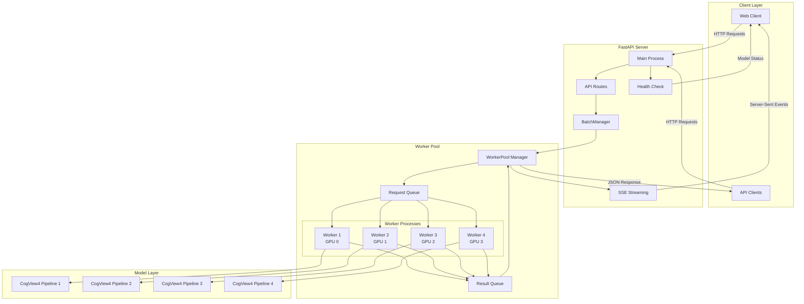

## 1.3. Core Components

### 1.3.1. FastAPI Application Layer

- **Main Process**: Handles HTTP requests and routes
- **API Routes**: OpenAI-compatible endpoints (`/v1/images/generations`)
- **Health Monitoring**: Real-time status of worker pool and model loading
- **SSE Streaming**: Server-Sent Events for real-time progress updates
- **BatchManager**: Intelligent batching of compatible requests for GPU efficiency

### 1.3.2. Prompt Batching System

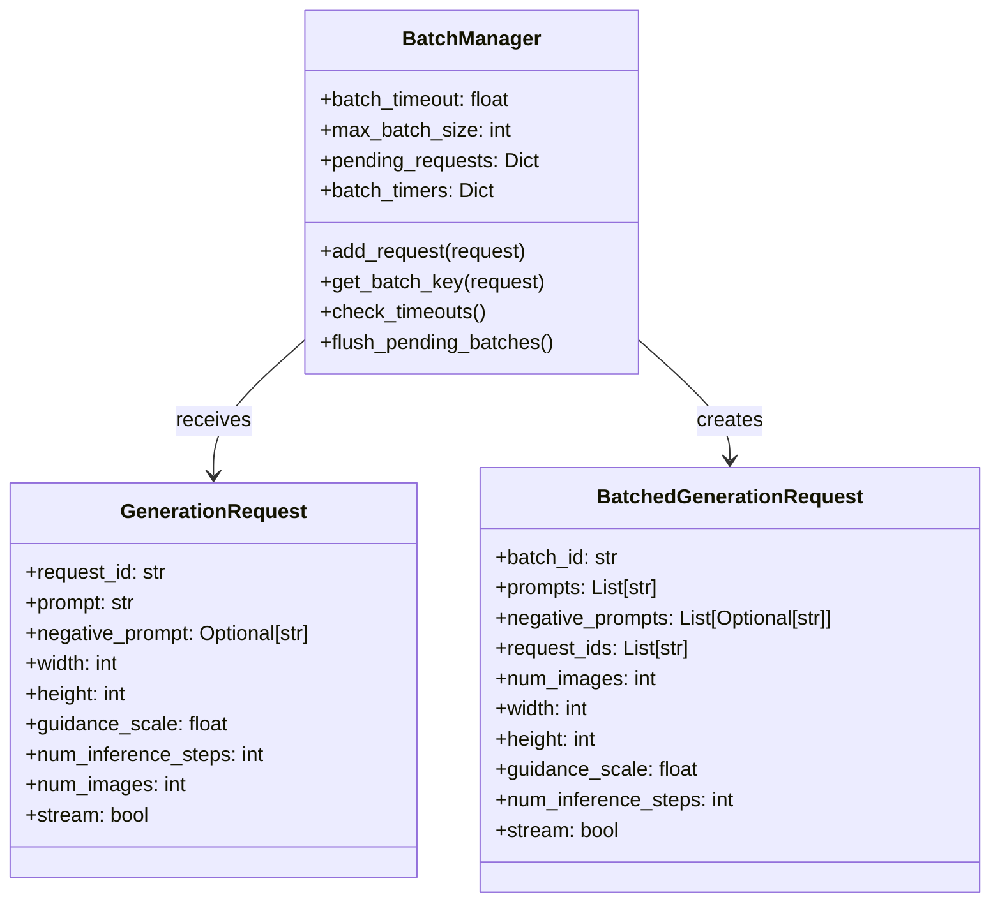

**Batching Logic:**
- Requests are grouped by compatible parameters: `(width, height, guidance_scale, num_inference_steps, stream, num_images)`
- Maximum batch size: 8 requests (configurable)
- Batch timeout: 0.5 seconds (configurable)
- Each request maintains its individual prompt and negative_prompt pairing
- Results are properly distributed back to individual requests

### 1.3.3. WorkerPool Architecture

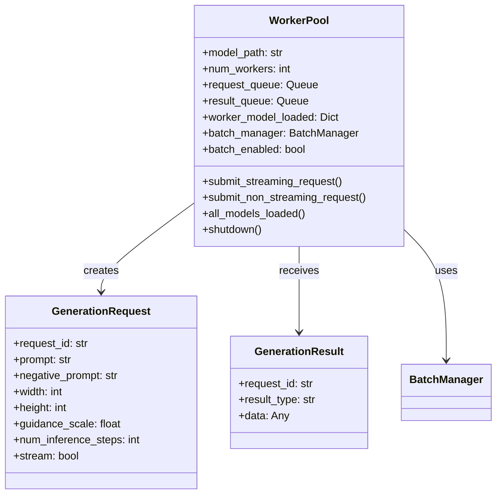

### 1.3.4. Worker Process Architecture

Each worker process:
- **Loads model once**: CogView4 pipeline with quantization
- **Handles multiple requests**: Uses `from_pipe()` for memory efficiency
- **GPU assignment**: Distributed across available GPUs
- **Independent operation**: No shared state between workers
- **Batch processing**: Can handle both individual and batched requests
- **Negative prompt handling**: Automatically converts `None` values to empty strings

## 1.4. Request Flow Diagrams

### 1.4.1. Prompt Batching Flow

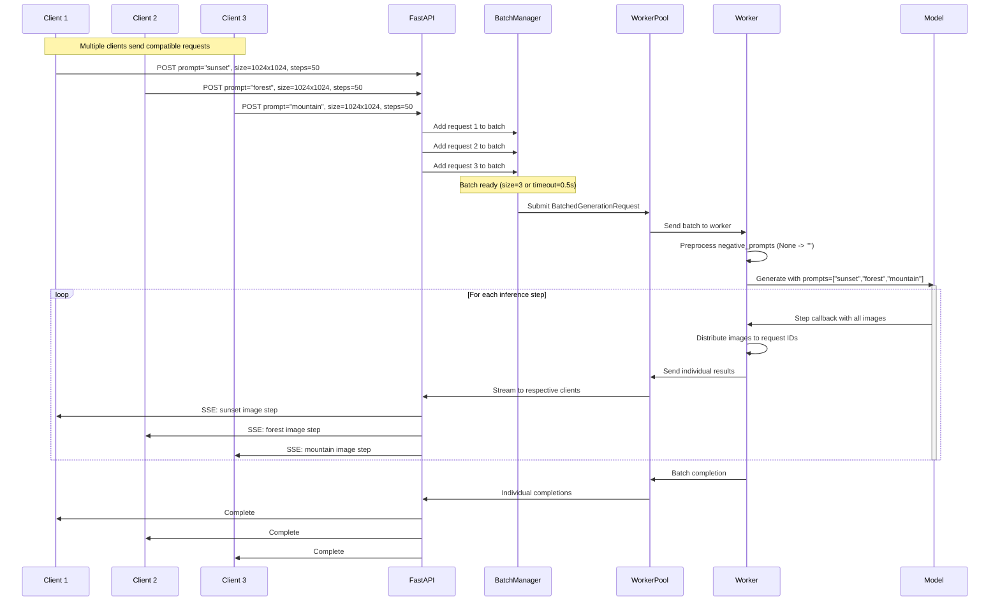

### 1.4.2. Streaming Request Flow

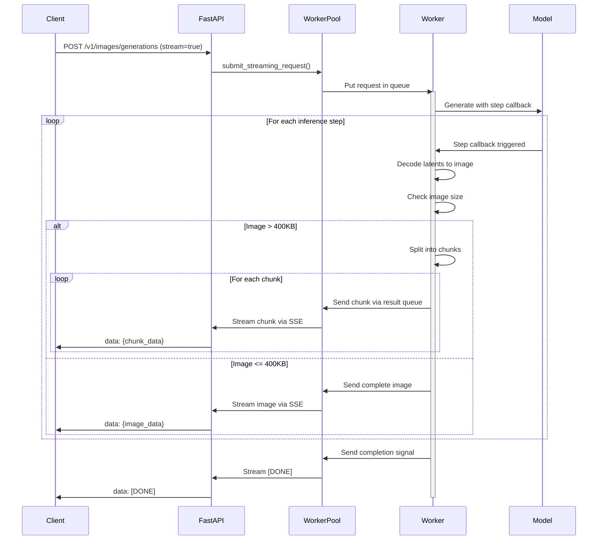

### 1.4.3. Non-Streaming Request Flow

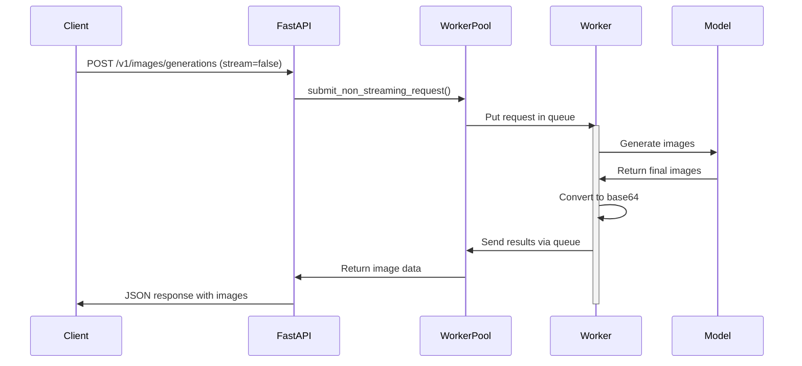

## 1.5. Chunking System

### 1.5.1. Server-Side Chunking

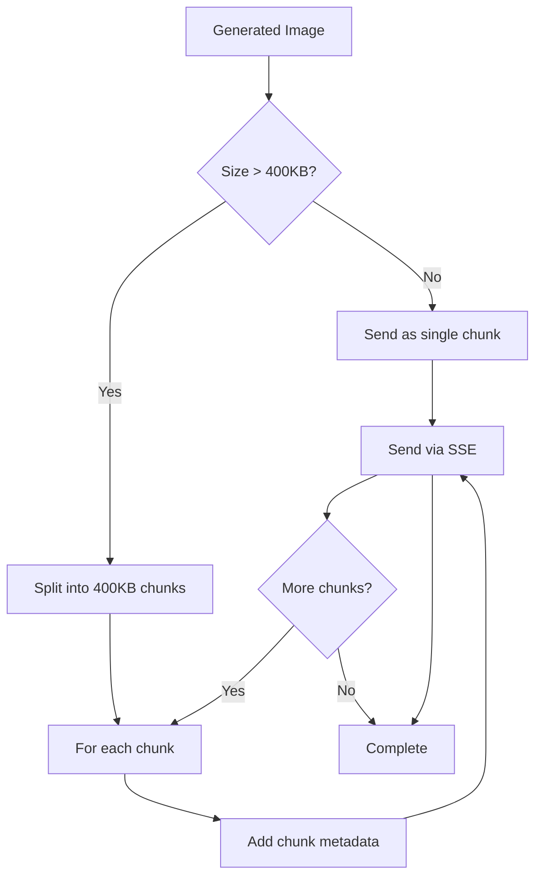

### 1.5.2. Client-Side Assembly

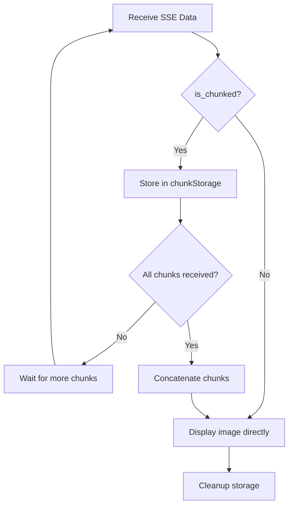

## 1.6. Data Models

### 1.6.1. Request Models

```python
class ImageGenerationRequest(BaseModel):
    prompt: str
    negative_prompt: Optional[str] = None
    n: int = 1  # Number of images
    size: str = "1024x1024"
    stream: bool = False
    guidance_scale: float = 5.0
    num_inference_steps: int = 50
    response_format: str = "b64_json"
```

### 1.6.2. Streaming Data Models

```python
class StreamingImageData(BaseModel):
    step: int
    total_steps: int
    progress: float
    image: Optional[str] = None
    timestamp: float
    is_final: bool = False
    # Chunking support
    is_chunked: bool = False
    chunk_id: Optional[str] = None
    chunk_index: Optional[int] = None
    total_chunks: Optional[int] = None
```

## 1.7. Performance Optimizations

### 1.7.1. Intelligent Prompt Batching

```mermaid
graph TD
    REQ1[Request 1: "sunset"] --> BM[BatchManager]
    REQ2[Request 2: "forest"] --> BM
    REQ3[Request 3: "mountain"] --> BM
    
    BM --> CHECK{Compatible?}
    CHECK -->|Yes| BATCH[Create Batch]
    CHECK -->|No| SEPARATE[Separate Processing]
    
    BATCH --> SINGLE[Single GPU Inference]
    SINGLE --> DISTRIBUTE[Distribute Results]
    
    DISTRIBUTE --> OUT1[Client 1: sunset images]
    DISTRIBUTE --> OUT2[Client 2: forest images]
    DISTRIBUTE --> OUT3[Client 3: mountain images]
    
    SEPARATE --> IND1[Individual Processing]
    SEPARATE --> IND2[Individual Processing]
```

**Batching Benefits:**
- **GPU Efficiency**: Single inference call for multiple prompts reduces GPU overhead
- **Memory Optimization**: Shared model execution for compatible requests
- **Throughput Increase**: Up to 3-5x improvement for batched requests
- **Fair Processing**: Individual prompt-negative_prompt pairing maintained
- **Timeout Protection**: 0.5s maximum wait ensures responsiveness

**Batch Compatibility Criteria:**
- Same image dimensions (width × height)
- Same guidance scale
- Same number of inference steps
- Same streaming preference
- Same number of images per prompt

### 1.7.2. Model Loading Strategy

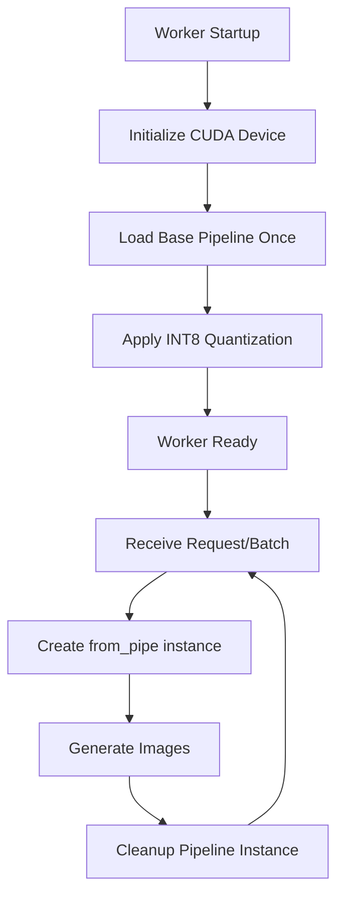

### 1.7.3. Memory Management

- **Quantization**: INT8 weight-only quantization for text encoder and transformer
- **from_pipe()**: Memory-efficient pipeline instances per request
- **GPU Distribution**: Workers distributed across available GPUs
- **Automatic Cleanup**: Pipeline instances cleaned after each request
- **Batch Processing**: Shared memory usage for compatible requests
- **Negative Prompt Handling**: Automatic None-to-empty-string conversion

### 1.7.4. Concurrency Model

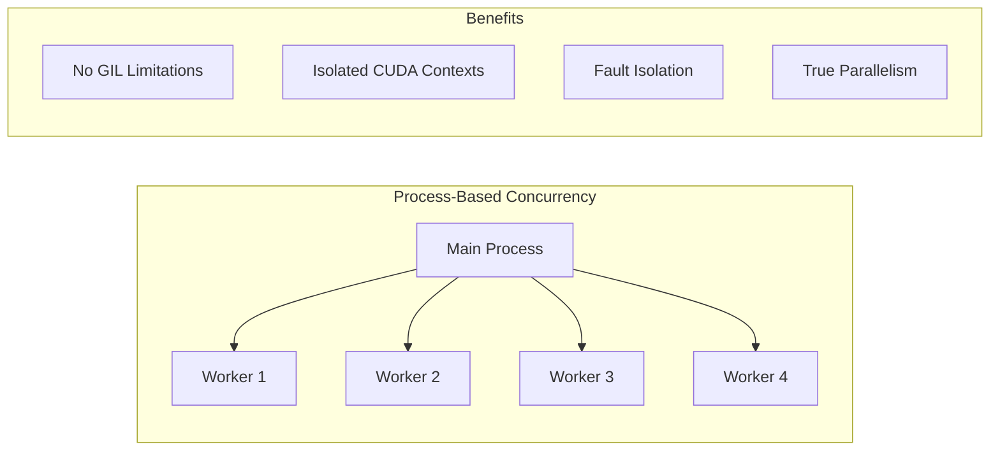

## 1.8. Health Monitoring

### 1.8.1. Model Loading Status

The API tracks model loading across all workers:

```python
def all_models_loaded(self) -> bool:
    """Returns True only when ALL workers have loaded their models"""
    loaded_workers = sum(1 for loaded in self.worker_model_loaded.values() if loaded)
    total_workers = len(self.workers)
    return loaded_workers == total_workers and total_workers > 0
```

### 1.8.2. Health Endpoint Response

```json
{
  "status": "healthy",
  "worker_pool_initialized": true,
  "active_workers": 4,
  "model_loaded": true,
  "concurrent_support": true,
  "architecture": "Persistent worker pool with from_pipe"
}
```

## 1.9. Error Handling

### 1.9.1. Worker-Level Error Handling

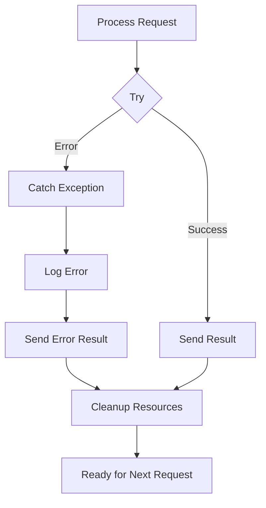

### 1.9.2. Client Error Handling

- **Network Errors**: Retry logic and connection management
- **Parsing Errors**: Graceful handling of malformed SSE data
- **Chunk Assembly**: Missing chunk detection and recovery
- **Timeout Handling**: Request timeout and cleanup

## 1.10. API Endpoints

### 1.10.1. Image Generation
- **Endpoint**: `POST /v1/images/generations`
- **Compatible**: OpenAI Images API
- **Streaming**: Server-Sent Events support
- **Chunking**: Automatic for large images

### 1.10.2. Health Check
- **Endpoint**: `GET /health`
- **Purpose**: Monitor worker pool and model status
- **Real-time**: Updated as workers load models

### 1.10.3. Status Information
- **Endpoint**: `GET /status`
- **Purpose**: Detailed server information
- **Features**: Lists all capabilities and architecture

### 1.10.4. Web Client
- **Endpoint**: `GET /client.html`
- **Purpose**: Interactive web interface
- **Features**: Real-time streaming, chunk assembly, progress tracking

## 1.11. Deployment Considerations

### 1.11.1. Hardware Requirements

- **GPU Memory**: 12GB+ VRAM per worker recommended
- **System RAM**: 16GB+ for model loading and processing
- **CPU**: Multi-core for handling concurrent requests
- **Storage**: Fast SSD for model loading

### 1.11.2. Environment Variables

```bash
# Logging configuration
LOG_LEVEL=INFO
LOG_FILE=cogview4_api.log

# Worker configuration
NUM_WORKER_PROCESSES=4

# Prompt batching configuration
ENABLE_PROMPT_BATCHING=true

# CUDA configuration
CUDA_LAUNCH_BLOCKING=1
CUDA_DEVICE_ORDER=PCI_BUS_ID
```

**Configuration Details:**

- **`ENABLE_PROMPT_BATCHING`**: Enable/disable intelligent prompt batching (default: `true`)
  - `true`: Requests with compatible parameters are batched together
  - `false`: All requests processed individually
- **`NUM_WORKER_PROCESSES`**: Number of worker processes (default: `4`)
  - Recommend 1-2 workers per GPU
  - Each worker loads ~12GB model into VRAM
- **`LOG_LEVEL`**: Logging verbosity (`DEBUG`, `INFO`, `WARNING`, `ERROR`)
- **`LOG_FILE`**: Log file path for persistent logging

### 1.11.3. Scaling Strategies

1. **Vertical Scaling**: Increase GPU memory and add more GPUs
2. **Worker Tuning**: Adjust `NUM_WORKER_PROCESSES` based on GPU count
3. **Load Balancing**: Multiple server instances behind a load balancer
4. **Chunking Tuning**: Adjust chunk size based on network capacity

## 1.12. Security Considerations

- **Input Validation**: Pydantic models with constraints
- **Resource Limits**: Request timeouts and memory limits
- **CORS Configuration**: Configurable cross-origin policies
- **Error Sanitization**: Safe error message exposure

This architecture provides a robust, scalable, and efficient image generation service with true concurrent processing, intelligent resource management, and excellent user experience through streaming capabilities. 